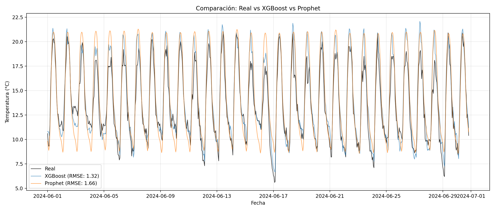

# 🌡️ Weather Pipeline - Predicción de Temperatura


## Introducción

Este proyecto implementa un pipeline industrial de Machine Learning para forecasting de temperatura a corto plazo. En este Pipeline aplicamos los siguientes conceptos y algoritmos:

1. **Análisis exploratorio:** Generación de métricas de estadística descriptiva para analizar el comportamiento de las variables del dataset. Medidas necesarias para tomar decisiones adecuadas en la limpieza de datos.

2. **Análisis temporal:** Análisis del comportamiento de las variables en función del tiempo.
   - **Variable objetivo (Temperatura):**
     - *ACF:* Medimos la correlación lineal entre la serie temporal en un instante de tiempo y ella misma desplazada k periodos para determinar relaciones entre instantes.
     - *PACF:* Mide correlación directa de la serie entre diferentes instantes de tiempo. Intenta explicar si hay relaciones entre instantes que no hayan sido identificados en iteraciones anteriores.
   - **Variables independientes (Velocidad del viento y humedad relativa):**
     - *Correlación cruzada:* Entre estas variables y la temperatura se utilizó para identificar qué valores pasados de las variables independientes ayudan a explicar los valores futuros de la variable objetivo.
   
   De este análisis se genera un documento con el criterio de selección de lags para las variables del dataset.

3. **Limpieza y preparación del dataset:** La identificación de los lags permite generar nuevas variables en el dataset más variables que representan ciclos temporales, para representar el comportamiento cíclico de las variables climáticas.

4. **Entrenamiento de modelos:** Los siguientes modelos fueron evaluados para comparación y selección:
   - Lasso, Ridge y Elastic Net
   - XGBoost

5. **Predicción y comparación** de rendimiento vs modelo comercial Prophet.

## 🎯 Resultados

| Modelo | RMSE | MAE | Skill vs Prophet |
|--------|------|-----|------------------|
| **XGBoost** | 1.32°C | 1.01°C | **+20.22%** |
| Prophet | 1.66°C | 1.29°C | baseline |

<p align="center">
  
</p>

## 📁 Estructura del Proyecto

```
weather_pipeline/
├── configs/
│   └── config.yaml           # Configuración de API y rutas
├── data/
│   ├── raw/                  # Datos crudos descargados
│   ├── processed/            # Datos limpios
│   ├── features/             # Features para entrenamiento
│   └── predict_data/         # Datos y resultados de predicción
├── docs/                     # Documentación detallada
├── models/
│   ├── xgboost_final.joblib  # Modelo entrenado
│   └── metadata/             # Metadatos del modelo
├── reports/
│   ├── analisis_temporal/    # Gráficas ACF, PACF, cross-correlation
│   └── figures/              # Gráficas de predicción y SHAP
├── src/
│   ├── ingest.py             # Descarga de datos
│   ├── explore.py            # Análisis exploratorio
│   ├── clean.py              # Limpieza de datos
│   ├── features.py           # Ingeniería de características
│   ├── temporal_diagnostics.py # Diagnósticos de series temporales
│   ├── train.py              # Entrenamiento de modelos
│   ├── predict.py            # Predicción y comparación
│   └── utils.py              # Utilidades
└── tests/
    └── test_clean.py         # Tests unitarios
```

## 🚀 Instalación

```bash
# Crear entorno virtual
python -m venv .venv

# Activar entorno (Windows)
.venv\Scripts\Activate.ps1

# Instalar dependencias
pip install -r requirements.txt
```

## 📊 Pipeline de ML


### Flujo de Ejecución

| Etapa | Script | Comando | Descripción |
|-------|--------|---------|-------------|
| 1. Ingesta | `ingest.py` | `python src/ingest.py` | Descarga datos de Open-Meteo |
| 2. Exploración | `explore.py` | `python src/explore.py` | Estadísticas descriptivas |
| 3. Limpieza | `clean.py` | `python src/clean.py` | Tratamiento de datos faltantes |
| 4. Diagnósticos | `temporal_diagnostics.py` | `python src/temporal_diagnostics.py` | ACF, PACF, cross-correlation |
| 5. Features | `features.py` | `python src/features.py` | Lags temporales y estacionalidad |
| 6. Entrenamiento | `train.py` | `python src/train.py --stage xgboost` | Ridge, XGBoost, SHAP |
| 7. Predicción | `predict.py` | `python src/predict.py` | Forecasting y comparación |

### Opciones de Entrenamiento

```bash
python src/train.py --stage separar_datos      # Solo separar datos
python src/train.py --stage lineales           # Entrenar modelos lineales
python src/train.py --stage xgboost            # Entrenar XGBoost (default)
python src/train.py --stage curvas_aprendizaje # Curvas de aprendizaje
python src/train.py --stage shap               # Análisis SHAP
```

## ⚙️ Configuración

Editar `configs/config.yaml`:

```yaml
open_meteo:
  latitude: 4.7110
  longitude: -74.0721
  timezone: America/Bogota
  hourly:
    - temperature_2m
    - relative_humidity_2m
    - wind_speed_10m
  start_date: "2024-01-01"
  end_date: "2024-06-30"

paths:
  raw_dir: data/raw
```

## 🔧 Features Utilizadas

- **Variables meteorológicas:** `temperature_2m`, `relative_humidity_2m`, `wind_speed_10m`
- **Lags temporales:** 1, 2, 3, 6, 12, 24 horas
- **Estacionalidad:** `hour`, `dayofweek`, `month`, `sin_comp`, `cos_comp`

## 📂 Archivos de Salida

| Archivo | Descripción |
|---------|-------------|
| `models/xgboost_final.joblib` | Modelo XGBoost entrenado |
| `models/metadata/xgboost_metadatos.json` | Hiperparámetros y métricas |
| `data/predict_data/predicciones_junio.xlsx` | Predicciones XGBoost |
| `data/predict_data/comparacion_modelos.xlsx` | XGBoost vs Prophet |
| `reports/figures/predicciones/` | Gráficas de predicción |
| `reports/figures/shap/` | Análisis SHAP |

## 📚 Documentación Detallada

| Documento | Descripción |
|-----------|-------------|
| [Análisis Exploratorio](docs/exploratory_analysis.md) | Estadísticas descriptivas y distribuciones |
| [Análisis Temporal](docs/temporal_analysis.md) | ACF, PACF, correlación cruzada |
| [Entrenamiento de Modelos](docs/model_training.md) | Comparación de modelos y curvas de aprendizaje |
| [Predicciones](docs/predictions.md) | Resultados y comparación con Prophet |
| [Interpretabilidad SHAP](docs/interpretability.md) | Explicabilidad del modelo |
| [Selección de Lags](docs/lag_selection.md) | Criterios de selección de variables |

## 🧪 Tests

```bash
pytest tests/
```

## 📝 Notas Técnicas

- **Horizonte de predicción:** 3 horas
- **Datos de entrenamiento:** Enero - Mayo 2024
- **Datos de predicción:** Junio 2024
- **API:** Open-Meteo (gratuita, sin API key)

## 📄 Licencia

MIT License
