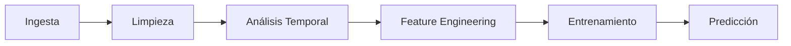

# 🌡️ Weather Pipeline - Predicción de Temperatura


Pipeline de Machine Learning para forecasting de temperatura a corto plazo utilizando datos meteorológicos de Open-Meteo.

## 🎯 Resultados

| Modelo | RMSE | MAE | Skill vs Prophet |
|--------|------|-----|------------------|
| **XGBoost** | 1.32°C | 1.01°C | **+20.22%** |
| Prophet | 1.66°C | 1.29°C | baseline |

<p align="center">
  
</p>

## 🚀 Quick Start

```bash
# Clonar e instalar
git clone https://github.com/tu-usuario/weather_pipeline.git
cd weather_pipeline
python -m venv .venv
.venv\Scripts\Activate.ps1  # Windows
pip install -r requirements.txt

# Ejecutar pipeline completo
python src/ingest.py              # Descargar datos
python src/clean.py               # Limpiar datos
python src/features.py            # Crear features
python src/train.py --stage xgboost  # Entrenar modelo
python src/predict.py             # Generar predicciones
```

## 📁 Estructura del Proyecto

```
weather_pipeline/
├── configs/config.yaml        # Configuración API y rutas
├── data/
│   ├── raw/                   # Datos crudos
│   ├── processed/             # Datos limpios
│   └── features/              # Features para entrenamiento
├── models/                    # Modelos entrenados (.joblib)
├── reports/figures/           # Gráficas y resultados
├── src/                       # Código fuente
└── docs/                      # Documentación detallada
```

## 📊 Pipeline de ML



| Etapa | Script | Descripción |
|-------|--------|-------------|
| Ingesta | `ingest.py` | Descarga datos de Open-Meteo |
| Exploración | `explore.py` | Estadísticas descriptivas |
| Limpieza | `clean.py` | Tratamiento de datos faltantes |
| Diagnósticos | `temporal_diagnostics.py` | ACF, PACF, cross-correlation |
| Features | `features.py` | Lags temporales y estacionalidad |
| Entrenamiento | `train.py` | Ridge, XGBoost, SHAP |
| Predicción | `predict.py` | Forecasting y comparación |

## 🔧 Features del Modelo

- **Variables meteorológicas:** temperatura, humedad relativa, velocidad del viento
- **Lags temporales:** 1, 2, 3, 6, 12, 24 horas
- **Estacionalidad:** hora, día de semana, mes, componentes cíclicos (sin/cos)

## 📚 Documentación Detallada

| Documento | Descripción |
|-----------|-------------|
| [Análisis Exploratorio](docs/exploratory_analysis.md) | Estadísticas descriptivas y distribuciones |
| [Análisis Temporal](docs/temporal_analysis.md) | ACF, PACF, correlación cruzada |
| [Entrenamiento de Modelos](docs/model_training.md) | Comparación de modelos y curvas de aprendizaje |
| [Predicciones](docs/predictions.md) | Resultados y comparación con Prophet |
| [Interpretabilidad SHAP](docs/interpretability.md) | Explicabilidad del modelo |
| [Selección de Lags](docs/lag_selection.md) | Criterios de selección de variables |

## ⚙️ Configuración

Editar `configs/config.yaml`:

```yaml
open_meteo:
  latitude: 4.7110      # Bogotá, Colombia
  longitude: -74.0721
  start_date: "2024-01-01"
  end_date: "2024-06-30"
```

## 🧪 Tests

```bash
pytest tests/
```

## 📝 Notas Técnicas

- **Horizonte de predicción:** 3 horas
- **Datos de entrenamiento:** Enero - Mayo 2024
- **Datos de validación:** Junio 2024
- **API:** Open-Meteo (gratuita, sin API key)

## 📄 Licencia

MIT License
