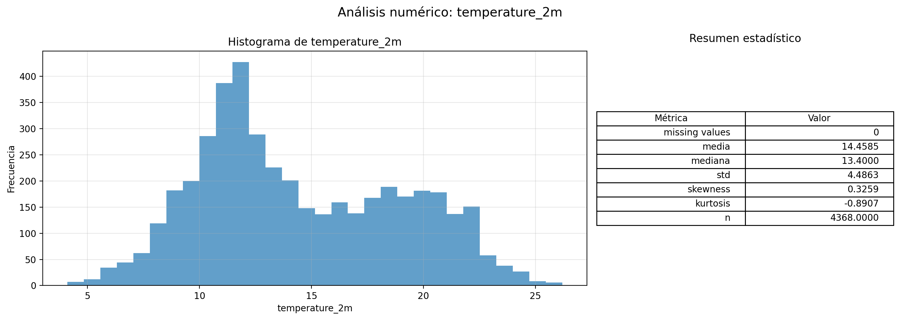
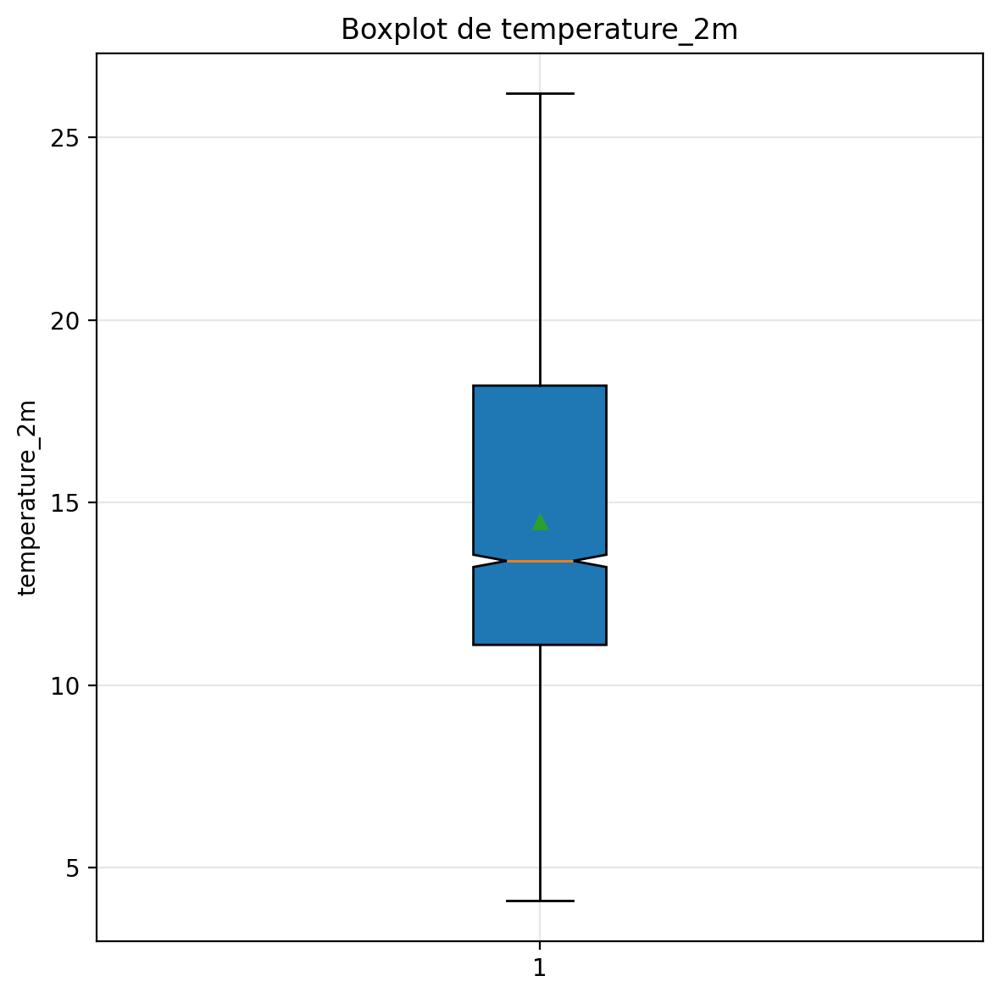
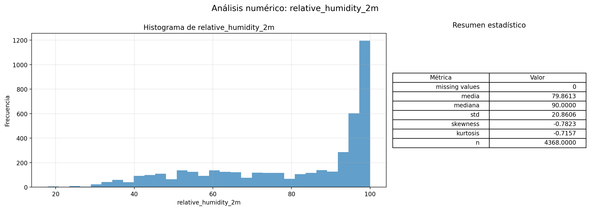
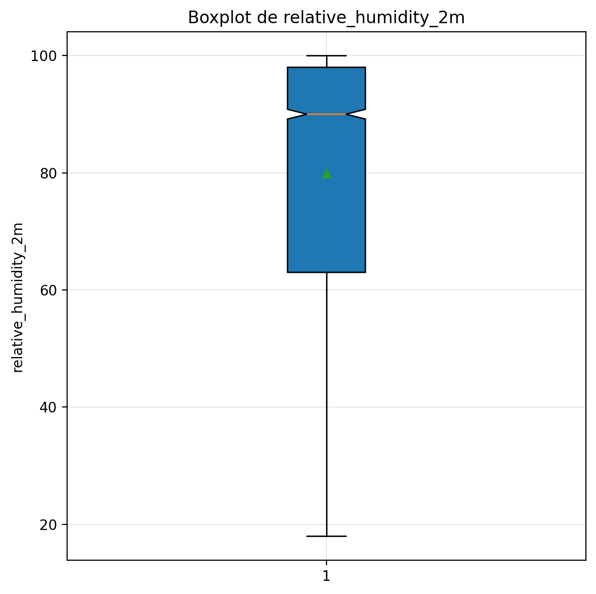
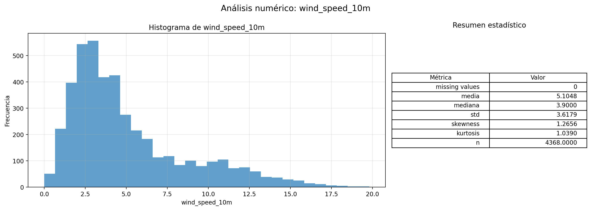
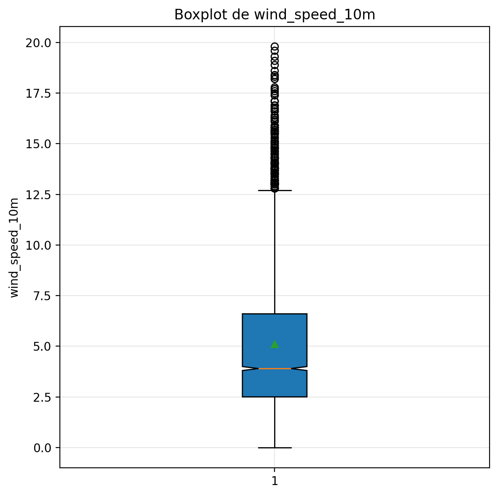

# 📊 Análisis Exploratorio

Este documento presenta el análisis exploratorio de datos (EDA) realizado sobre las variables meteorológicas del dataset.

## Variables Analizadas

- `temperature_2m` - Temperatura a 2 metros (°C)
- `relative_humidity_2m` - Humedad relativa a 2 metros (%)
- `wind_speed_10m` - Velocidad del viento a 10 metros (km/h)

---

## 🌡️ Temperatura (temperature_2m)

### Distribución y Estadísticas

  

- La variable objetivo muestra en su histograma un comportamiento continuo, indicando que la serie es completa. La media, valor esperado de la distribución, correspónde a 14.46 °C.
- La distribución esta ligeramente desplazada a la derecha indicando que existen mas valores cuya magnitud es mayor a la media y mediana.
- La mediana es el valor que divide la muestra en partes iguales. Este valor es de 13.40 °C, valor que es menor a la media. Luego, como la media es mayor a la mediana, la distribución presenta una asimetría positiva.
- La desviación estandar corresponde es de 4.49 °C. Este valor me indica que la mayor concentración ocurre dentro del rango μ±σ.
- Skewness de 0.33 indica una cola mas larga a la derecha, congruente con la conclusión que la media es mayor a la mediana.
- Kurtosis de -0.89 indica que la distribución no cuenta con picos altos y se distribuye mas o menos uniforme en el dominio de los datos existente.

### Detección de Outliers

  

En el caso del boxplot, esta grafica permite visualizar explicitamente que la mediana, representada por la traza naranja es mejor por la media, representada por el triangulo verde implicando la asimetria positiva mostrada en el histograma.

El IQR delimitado por Q1 = 11 °C y Q3 = 18 °C corresmponde a la resta de estos valores, 7 °C. El 50% de los datos se concentra en un intervalo relativamente amplio, reflejando variabilidad termica. En la gráfica, los bigotes representan el rango de los datos dentro de 1.5 *IQR, indicando que la serie tiene un amplio rango sin evidencia de valores anomalos ni outliers.
---
## 💧 Humedad Relativa (relative_humidity_2m)

### Distribución y Estadísticas

  

- La distribución de esta variable no tiene valores nulos. La media es de 79.86%.
- La distribución esta desplazada a la izquierda, presentando varios valores concentrados en valores entre el 90% y el 100%. 
- La mediana es el valor que divide la muestra en partes iguales. Este valor es de 90%, valor que es mayor a la media. Luego, como la media es menor a la mediana, la distribución presenta una asimetría negativa.
- La desviación estandar es de 20.86%. Sin embargo esta distribución no es gaussiana. Esdta desviación permite indicar que aunque hay valores de alta humedad, existen varios valores que indican condiciones secas.
- Skewness de -0.78 indica una cola mas larga a la izquierda, congruente con la conclusión que la media es mayor a la mediana.
- Kurtosis de -0.72 indica que la distribución es platicurtica.

### Detección de Outliers

  

El  box plot ilustra que la media es menor a la mediana. El IQR esta se encuentra entre los valores de 98% y 62%. El 50% de la masa central de los datos se concentran en valores altos de humedad. Por ultimo los vigotes no son simétricos, mostrando que la distribución esta saturada en valores altas mientras que los valores valores menores al 62% representan eventos ocacionales de baja humedad.

---

## 💨 Velocidad del Viento (wind_speed_10m)

### Distribución y Estadísticas

  

- La distribución de velocidad del viento no presenta valores nulos, confirmando una serie completa.
- La media es significativamente mayor que la mediana, indicando una distribución con asimetría positiva (sesgada a la derecha).
- La concentración de valores en el rango bajo con una cola larga hacia valores altos es típica de variables de viento, siguiendo una distribución similar a Weibull.
- El skewness positivo confirma la cola derecha más larga, representando eventos ocasionales de vientos fuertes.
- La kurtosis indica presencia de valores extremos más frecuentes que en una distribución normal.

### Detección de Outliers

  

El boxplot muestra claramente la asimetría positiva con la mediana desplazada hacia el límite inferior del IQR. Los bigotes asimétricos reflejan que los valores altos de viento son eventos menos frecuentes pero presentes en el dataset. Los puntos más allá del bigote superior representan eventos de vientos fuertes que, aunque estadísticamente son outliers, son meteorológicamente válidos y no deben eliminarse.

---

## 📝 Conclusiones del Análisis Exploratorio

### Resumen por Variable

| Variable | Distribución | Asimetría | Outliers | Observación |
|----------|-------------|-----------|----------|-------------|
| Temperatura | Unimodal, continua | Positiva (0.33) | No | Variable objetivo estable |
| Humedad | Concentrada en valores altos | Negativa (-0.78) | No | Clima tropical húmedo |
| Viento | Sesgada a la derecha | Positiva | Meteorológicos | Eventos de vientos fuertes válidos |

### Decisiones para el Pipeline

1. **Sin imputación necesaria:** Las tres variables están completas, sin valores nulos.
2. **Sin tratamiento de outliers:** Los valores extremos son meteorológicamente válidos y aportan información.
3. **Escalado recomendado:** Dado los diferentes rangos (°C, %, km/h), se recomienda estandarización para modelos lineales.
4. **Feature engineering:** La variabilidad en humedad y viento sugiere que los lags de estas variables pueden aportar poder predictivo. Se utilizaran modelos lineales, modelo machine learning y deep learning.

---

[← Volver al README principal](../README.md)
