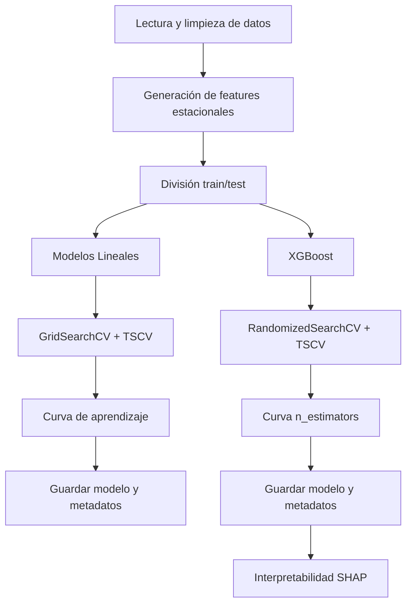

# 🏗️ Flujo de Entrenamiento de Modelos

Este documento describe paso a paso el flujo de entrenamiento implementado en `src/train.py` para modelos lineales (Lasso, Ridge, Elastic Net) y XGBoost.

---

## 1. Preparación de Datos

1. **Lectura de datos:**
   - Se lee el archivo `data/features/features.csv` con la función `leer_archivo_csv()`.
   - Se convierte la columna `time` a formato datetime y se eliminan filas con fechas inválidas.
2. **Exclusión de datos de predicción:**
   - Se excluye el mes de junio para evitar data leakage (solo se usa para predicción) en el bloque principal (`main`).
3. **Generación de columnas de estacionalidad:**
   - Se agregan columnas: `dayofweek`, `month`, `hour`, `sin_comp`, `cos_comp` usando la función `columnas_estacionalidad()`.
4. **División train/test:**
   - 80% para entrenamiento, 20% para prueba, respetando el orden temporal, usando la función `dividir_train_test()`.

---

## 2. Entrenamiento de Modelos Lineales

1. **Modelos considerados:** Lasso, Ridge, Elastic Net (todos con escalado estándar).
2. **Búsqueda de hiperparámetros y entrenamiento:**
   - Se usa la función `modelos_lineales()` que implementa `GridSearchCV` con validación cruzada tipo `TimeSeriesSplit` (5 splits).
   - Se exploran valores de `alpha` (y `l1_ratio` para Elastic Net).
   - Métricas: RMSE y MAE (negativos para maximizar en sklearn).
   - Se selecciona el mejor modelo por RMSE de validación cruzada y se evalúa en test.
3. **Curva de aprendizaje:**
   - Se genera una curva de aprendizaje para el mejor modelo lineal con la función `plot_curvas_aprendizaje()`.
4. **Guardado:**
   - Se guarda el modelo entrenado con `guardar_modelo()` y sus metadatos con `guardar_metadatos()`.

---

## 3. Entrenamiento de XGBoost

1. **Definición del modelo base y búsqueda de hiperparámetros:**
   - Se usa la función `entrenar_xgboost()` que implementa `RandomizedSearchCV` con `TimeSeriesSplit` (5 splits) y explora hiperparámetros como `max_depth`, `min_child_weight`, `subsample`, `colsample_bytree`, `gamma`, `reg_alpha`, `reg_lambda`, `learning_rate`.
   - Métricas: RMSE y MAE.
   - Se selecciona el mejor modelo por RMSE de validación cruzada y se evalúa en test.
2. **Curva de aprendizaje purista:**
   - Se entrena el modelo final con los mejores hiperparámetros y muchos árboles usando la función `xgb_learning_curve_purista()`.
   - Se extrae la curva de RMSE por boosting round y se determina el número óptimo de árboles (`n_estimators`).
   - Se reentrena el modelo final con ese número óptimo.
3. **Guardado:**
   - Se guarda el modelo entrenado con `guardar_modelo()` y sus metadatos con `guardar_metadatos()`.

---

## 4. Interpretabilidad (SHAP)

1. **Cálculo de valores SHAP:**
   - Se usa la función `analisis_shap()` que implementa `shap.TreeExplainer` para explicar el modelo XGBoost.
   - Se generan gráficos de importancia global, dependencia, waterfall y force plots.
2. **Exportación:**
   - Se guardan los valores SHAP y las gráficas en `reports/figures/shap/`.

---

## 5. Resumen Visual (Mermaid)

---

[← Volver al README principal](../README.md)
