# 🔍 Interpretabilidad del Modelo - SHAP

Este documento presenta el análisis de interpretabilidad del modelo XGBoost utilizando SHAP (SHapley Additive exPlanations).

**Interpretación:** 
Esta gráfico ilustra un ranking de variables que utilizará el modelo para realizar su predicción. En este caso, se puede analizar que el modelo se ve fuertemente influenciado por la variable creada para capturar el componente de estacionalidad diaria, lo cual es bastante congruente con una variable que depende directamente de la irradiancia solar. Adicionalmente, la temperatura en el momento presente, la humedad en el momento presente y retrasada doce horas para realizar su función.

---

## 📊 Importancia de Features

### Feature Importance Global

  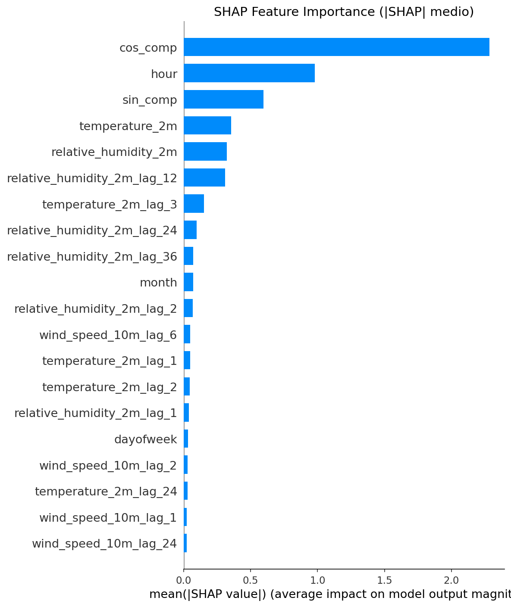

---

## 🐝 SHAP Beeswarm Plot

  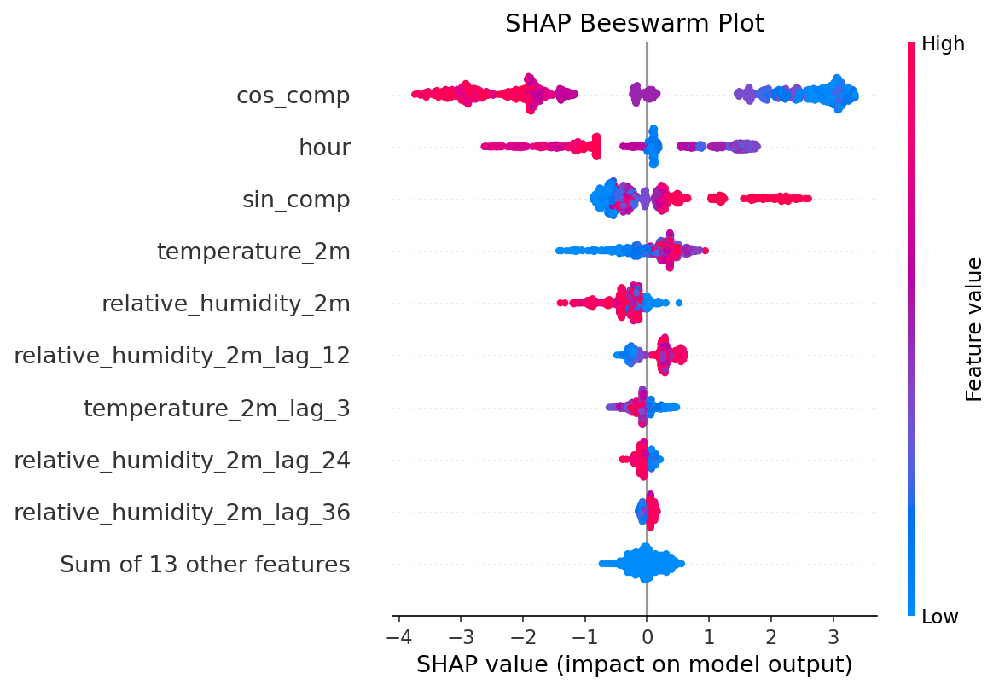

**Interpretación:** 
Este grafico permite realizar una interpretación causal entre la variable objetivo y y cada una de las variables predictoras. En este caso el grafico permite visualizar el impacto de la variable, tanto en valores positivos y negativos de la predicción.

- El color indica el valor de la feature (rojo = alto, azul = bajo)
- La posición horizontal indica el impacto en la predicción

1. En este grafico, se puede observar por que la variable cos_comp se encuentra en el top 1 del grafico Shap feature importance. Esta variable tiene un impacto en todo el rango de predicción de las variable onjnetivo. Esta variable recontruye el ciclo diario necesario para predecir la temperatura.

2. Las variables, hour & sin_comp tienden a tener un impacto relevante en la predicción. La variable Hour da información explicita sobre el comportamiento ciclico de la variable, trabajando muy bien con la variable cos_comp and sin_comp. Por último, la variable sin_comp tiene mayor impacto en el modelo para realizar predicciónes de temperatura positivas. Esto indica que esta variable tiene un alto impacto para temperatuas diurnas.

3. Se puede observar que temperatura y humedad en instantes actuales tambien impactan la predicción de la temperatura en el horizonte objetivo.(t=3 hrs). 

4. El grafico discrimina el impacto de los retrasos importantes. Para la humedad, ilustra que la variable retrasada 12, 24 y 36 horas impactan en menor medida que las variables que capturar el comportamiento ciclico del día, siendo dimilar su impacto para la temperatrura retrasada en 3 horas.

El grafico SHAP Summary Dot Plot ilustra los concluido anteriormente de mayor a menor impacto como consulta adicional. 
---

## 📈 SHAP Summary Dot Plot

  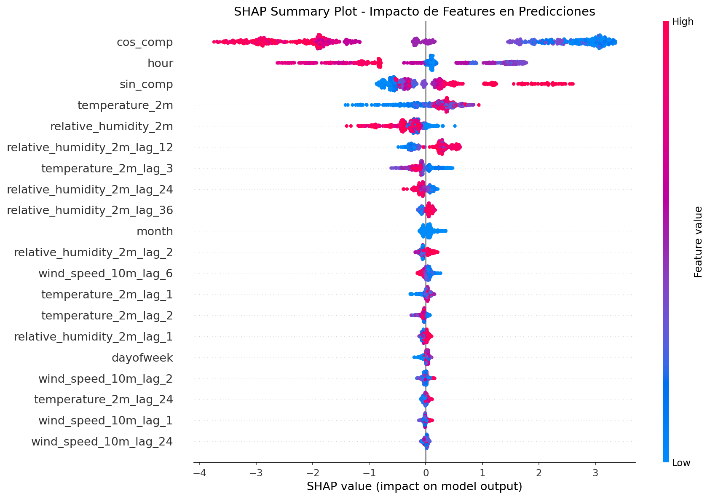

---

## 🔗 Gráficas de Dependencia

Las gráficas de dependencia muestran cómo el valor de una feature afecta la predicción.

### Componente Coseno (Estacionalidad)

  

Este grafico describe el comportamiento solar, donde -1 corresponde a la maxima irradiancia y +1 a la minima irradiacia. 

- cos_comp = -1 entre las 12 - 14 horas del día, esta varible tiene un alto impacto en la predicción.
- cos_comp = 1 en la noche y madrugada, aportando poco a la predicción.
- cos_comp = 0 en las transiciones de dia/noche, la variable no es importante en la para el modelo en la predicción.

### Temperatura Actual

  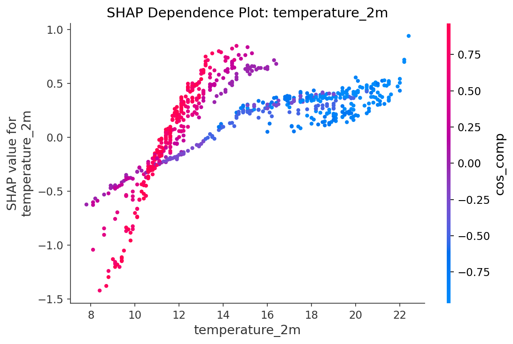

Este gráfico ilustra que el modelo logra diferenciar el momento del día independientemente de la similitud en la magnitud de la temperatura.En este caso, la barra de color es la varible cos_comp, que describe el comportamiento ciclico diario del día.

### Hora del Día

  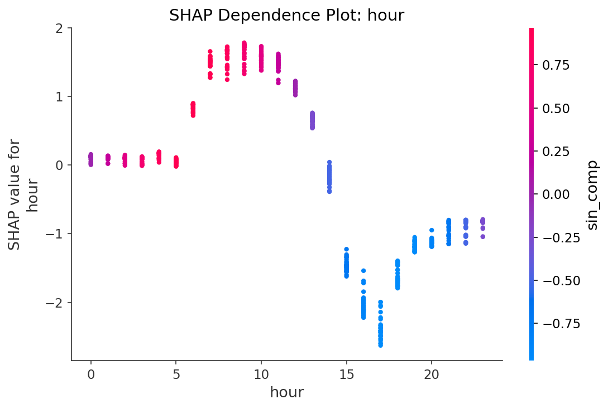

En este caso, el grafico ilustra como el modelo utiliza la información explicita respecto a las horas para la predicción.

| Rango horario | SHAP(hour)  | Interpretación                 |
| ------------- | ----------- | ------------------------------ |
| 0–5           | ≈ 0         | ajuste mínimo |
| 6–11          | +1 a +1.8   | impulso positivo      |
| 12–14         | +0.5 a +1.2 | corrección leve     |
| 15            | ≈ 0         | Transición                     |
| 16–18         | −2 a −2.5   | corrección negativa    |
| 19–23         | −1.2 a −0.8 | caída gradual          |

### Humedad Relativa (Lag 12h)

  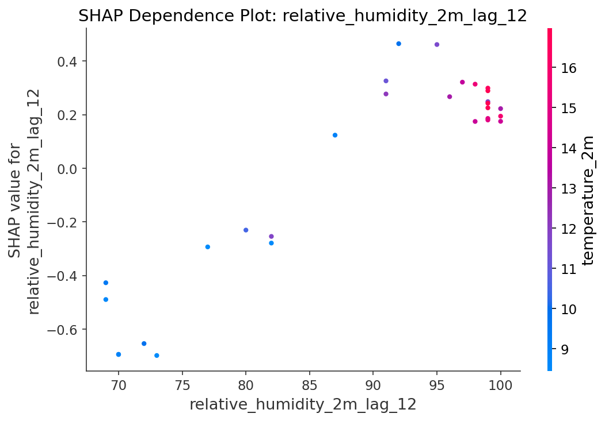

### Componente Seno (Estacionalidad)

  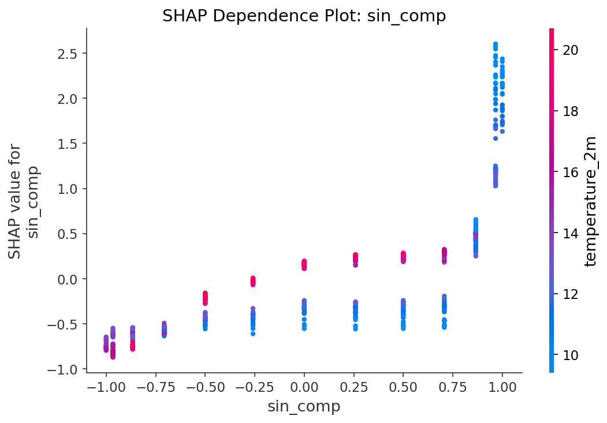

### Día de la Semana

  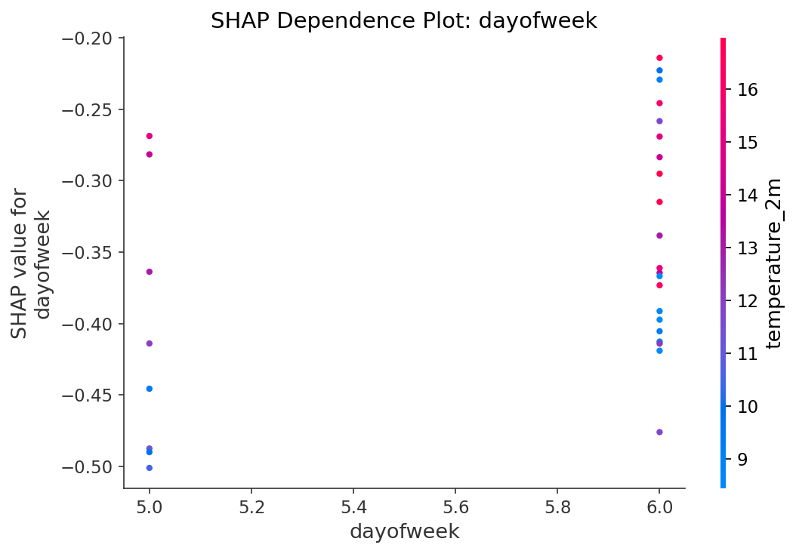

---

## 🌊 Waterfall Plots

Los waterfall plots muestran cómo cada feature contribuye a una predicción individual.

### Predicción 1

  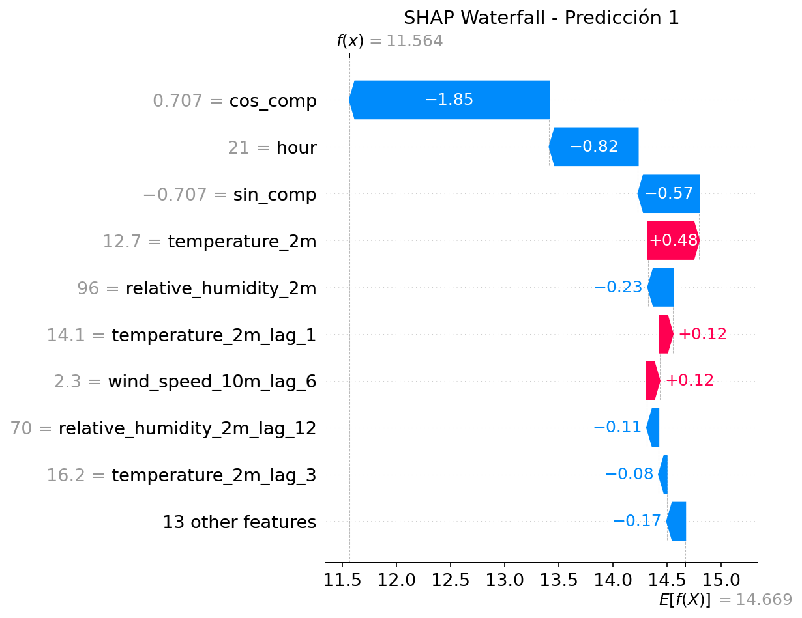

### Predicción 2

  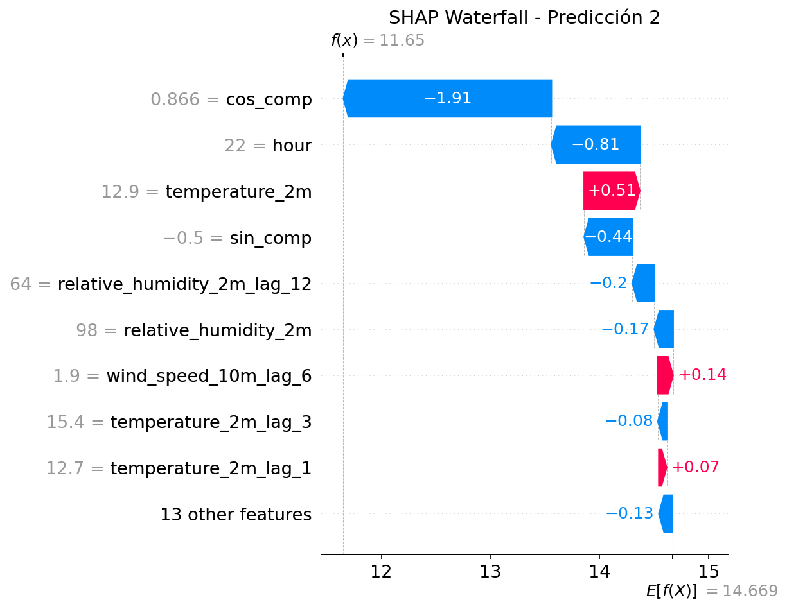

### Predicción 3

  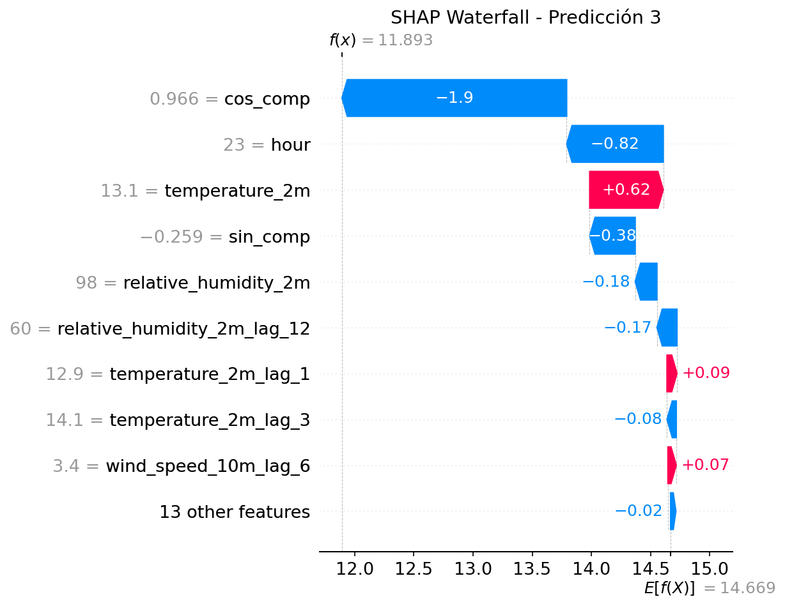

---

## 🎯 Force Plots Interactivos

Para visualizaciones interactivas, abrir los siguientes archivos HTML:

- [Force Plot Individual](../reports/figures/shap/shap_force_plot_single.html)
- [Force Plot Múltiple](../reports/figures/shap/shap_force_plot_multi.html)

---

## 📝 Conclusiones de Interpretabilidad

1. **Feature más importante:** La temperatura actual (`temperature_2m`) es el predictor más fuerte.
2. **Estacionalidad relevante:** Los componentes sin/cos capturan el ciclo diario.
3. **Humedad como predictor secundario:** Los lags de humedad aportan información complementaria.
4. **Modelo interpretable:** Las relaciones capturadas son físicamente coherentes.

---

## 📂 Archivos de Datos

| Archivo | Descripción |
|---------|-------------|
| `reports/figures/shap/shap_feature_importance.csv` | Importancia de features |
| `reports/figures/shap/shap_values_test.csv` | Valores SHAP para test set |

---

[← Volver al README principal](../README.md)
