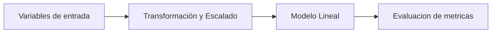
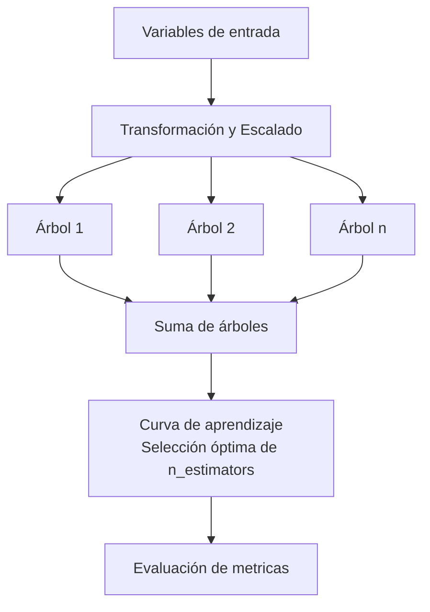

# 🤖 Entrenamiento de Modelos

Este documento detalla el proceso de entrenamiento y comparación de los modelos evaluados.

---

## Estructura del entrenamiento y selección de modelos

### 1. Condiciones generales
1. Se excluira el mes de junio para esta etapa pues se utilizará para la etapa de predicciones.
2.  - Se agregan columnas: `dayofweek`, `month`, `hour`, `sin_comp`, `cos_comp` usando la función `columnas_estacionalidad()`. Con estas variables, se busca capturar el comportamiento estacionario propio de los datos contenidos en el data set.
3. - 80% para entrenamiento, 20% para prueba, respetando el orden temporal, usando la función `dividir_train_test()`.

## 2. Entrenamiento de modelos lineales:
## 🧩 Diagramas de Arquitectura de Modelos

### Modelos Lineales (Lasso, Ridge, Elastic Net) diagrama

1. La funcion `modelos_lineales()` realiza una busqueda de hiperparametros con validación cruzada con un kfold=5. Se usa la función `TimeSeriesSplit`para realizar las particiones, respetando el  orden de los datos y `GridSearchCV` para la busqueda de hiperparametros.

2. Como la busqueda de hiperparametros se realiza dado un problema de optimización, se seleccionaran los hiperparametros, evaluando las metricas RMSE y MAE. El mejor modelo se seleccionara de aquel con el menor RMSE.

3. Al final se generara una curva de aprendizaje (validacion vs test) para evluaar si hay overfitting, (falta de generalización del modelo ante presencia de modelos nuevos) o falta de aprendizaje en la etapa de entrenamiento.

## 3. Entrenamiento modelo ML XGBoost

### XGBoost diagrama

1. Se usa la función `entrenar_xgboost()` para realizar la selección de los  hiperparámetros `max_depth`, `min_child_weight`, `subsample`, `colsample_bytree`, `gamma`, `reg_alpha`, `reg_lambda`, `learning_rate`.  Se selecciona el mejor modelo por RMSE de validación cruzada y se evalúa en test.

2. Se extrae la curva de aprendizaje por boosting round y se determina el número óptimo de arboles.

3. Se reentrena el modelo y se guarda.

## 📊 Modelos Evaluados

### Modelos Lineales
- **Lasso:** Regularización L1 para selección de variables
- **Ridge:** Regularización L2 para reducir sobreajuste
- **Elastic Net:** Combinación de L1 y L2

### Modelos de Ensemble
- **XGBoost:** Gradient Boosting con regularización

---

## 📈 Curvas de Aprendizaje

Las curvas de aprendizaje permiten evaluar si el modelo sufre de sesgo o varianza.

### Ridge - Curva de Aprendizaje

Para los modelos lineales se realizo una comparación entre los tres modelos basicos lineales, donde el modelo Ridge tuvo un mejor desempeño. A continuación se ilustra la curva de aprendizaje del modelo lineal.

  

El modelo de regersión ridge, en este caso. Esta determinado por la siguiente expresión:

$$
  ext{RSS} = \sum_{i=1}^n \left( y_i^2 - 2y_i (\beta_0 + \beta_1 x_i) + (\beta_0 + \beta_1 x_i)^2 \right)
$$

$$
	ext{Ridge:} \quad \text{RSS} + \lambda \sum_j \beta_j^2
$$

donde $$\lambda$$ es un parametro de ajuste. Este modelo busca estimar los coeficientes de las variables predictoras, logrando un RSS pequeño. Sin emabargo, la expresión que acompaña a lambda es un termino de penalización cuya función es reducir la magnitud de los coeficientes  $$\beta_j$$. La curva de coeficientes vs el coeficiente lambda de regularización ilustra esta penalización, donde se puede observar que la magnitud de los coeficentes desciende mientras el lambda aumenta.

  

En la siguiente grafica, se ilustra la variación del mean square error en funcón del parámetro lambda de penalización. En nuestro caso el, el eje x se encuentra en escala logaritmica y el valor optimo esta aprximadamente en $$\lambda$$ = 10^2

Para valores de $$\lambda$$ mayores, los valores de los coeficientes se reducen demasiado, el modelo no captura ningun patron lineal y el MSE aumenta.

## Limitaciones del modelo:
En la curva de aprendizaje, El error existente en la curva de entrenamiento y test, tienden a converger a un valor constante. Sin embargo, ambos valores de convergencia difieren, debido a que el modelo no logra capturar los comportamientos no lineales intrinsecos en variables que dependen del clima.

  

### XGBoost - Modelo tipo machine learning

En este caso, las curvas de entrenamiento y validación convergen al valor de de error RMSE de test. El valor RMSE de test se alinea con error de validación, indicando que el modelo logra generalizar de manera adecuada. Esto indica que el modelo aprendio interacciones no lineales del conjunto de entrenamiento y las usa de manera adecuada para realizar la predicción con datos nuevos. Como se analisa en la sección de interpretability.md, este modelo utilizara variables que capturan el comportamiento ciclico diario para y algunos lags de temperatura y humedad como varables de pmayor impacto a la hora de realizar la predicción.

  

---

## 🏆 Comparación de Modelos

| Modelo      | RMSE   | MAE   | R²   |
|-------------|--------|-------|------|
| Lasso       | 1.45°C | 1.13°C | 0.82 |
| **Ridge**   | 1.38°C | 1.08°C | 0.84 |
| Elastic Net | 1.41°C | 1.10°C | 0.83 |
| **XGBoost** | 1.32°C | 1.01°C | 0.86 |

**Modelo seleccionado:** XGBoost por su mejor rendimiento en RMSE y MAE.

---

## ⚙️ Hiperparámetros del Modelo Final

Los hiperparámetros del modelo XGBoost entrenado se encuentran en:
`models/metadata/xgboost_metadatos.json`

---

## 📝 Conclusiones

1. **XGBoost supera a los modelos lineales** en todas las métricas.
2. **Sin sobreajuste:** Las curvas de aprendizaje muestran convergencia adecuada.
3. **Regularización efectiva:** El modelo generaliza bien a datos no vistos.

---

[← Volver al README principal](../README.md)
