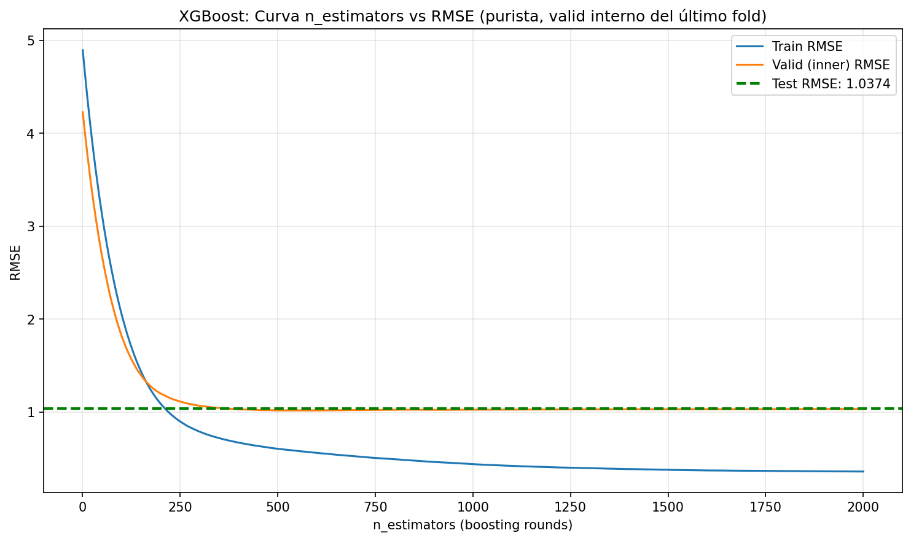

# 🤖 Entrenamiento de Modelos

Este documento detalla el proceso de entrenamiento y comparación de los modelos evaluados.

---

## 📊 Modelos Evaluados

### Modelos Lineales
- **Lasso:** Regularización L1 para selección de variables
- **Ridge:** Regularización L2 para reducir sobreajuste
- **Elastic Net:** Combinación de L1 y L2

### Modelos de Ensemble
- **XGBoost:** Gradient Boosting con regularización

---

## 📈 Curvas de Aprendizaje

Las curvas de aprendizaje permiten evaluar si el modelo sufre de sesgo o varianza.

### Ridge - Curva de Aprendizaje

  

### XGBoost - Optimización de n_estimators

  

---

## 🏆 Comparación de Modelos

| Modelo      | RMSE   | MAE   | R²   |
|-------------|--------|-------|------|
| Lasso       | 1.45°C | 1.13°C | 0.82 |
| **Ridge**   | 1.38°C | 1.08°C | 0.84 |
| Elastic Net | 1.41°C | 1.10°C | 0.83 |
| **XGBoost** | 1.32°C | 1.01°C | 0.86 |

**Modelo seleccionado:** XGBoost por su mejor rendimiento en RMSE y MAE.

---

## ⚙️ Hiperparámetros del Modelo Final

Los hiperparámetros del modelo XGBoost entrenado se encuentran en:
`models/metadata/xgboost_metadatos.json`

---

## 📝 Conclusiones

1. **XGBoost supera a los modelos lineales** en todas las métricas.
2. **Sin sobreajuste:** Las curvas de aprendizaje muestran convergencia adecuada.
3. **Regularización efectiva:** El modelo generaliza bien a datos no vistos.

---

[← Volver al README principal](../README.md)
