# 🤖 Entrenamiento de Modelos

Este documento detalla el proceso de entrenamiento y comparación de los modelos evaluados.

---

## Estructura del entrenamiento y selección de modelos

### 1. Condiciones generales
1. Se excluira el mes de junio para esta etapa pues se utilizará para la etapa de predicciones.
2.  - Se agregan columnas: `dayofweek`, `month`, `hour`, `sin_comp`, `cos_comp` usando la función `columnas_estacionalidad()`. Con estas variables, se busca capturar el comportamiento estacionario propio de los datos contenidos en el data set.
3. - 80% para entrenamiento, 20% para prueba, respetando el orden temporal, usando la función `dividir_train_test()`.

## 2. Entrenamiento de modelos lineales:
## 🧩 Diagramas de Arquitectura de Modelos

### Modelos Lineales (Lasso, Ridge, Elastic Net) diagrama

```mermaid
flowchart LR
  X[Variables de entrada] --> F[Transformación y Escalado]
  F --> L[Modelo Lineal]
  L --> Y[Evaluacion de metricas]
```

1. La funcion `modelos_lineales()` realiza una busqueda de hiperparametros con validación cruzada con un kfold=5. Se usa la función `TimeSeriesSplit`para realizar las particiones, respetando el  orden de los datos y `GridSearchCV` para la busqueda de hiperparametros.

2. Como la busqueda de hiperparametros se realiza dado un problema de optimización, se seleccionaran los hiperparametros, evaluando las metricas RMSE y MAE. El mejor modelo se seleccionara de aquel con el menor RMSE.

3. Al final se generara una curva de aprendizaje (validacion vs test) para evluaar si hay overfitting, (falta de generalización del modelo ante presencia de modelos nuevos) o falta de aprendizaje en la etapa de entrenamiento.

## 3. Entrenamiento modelo ML XGBoost


### XGBoost diagrama
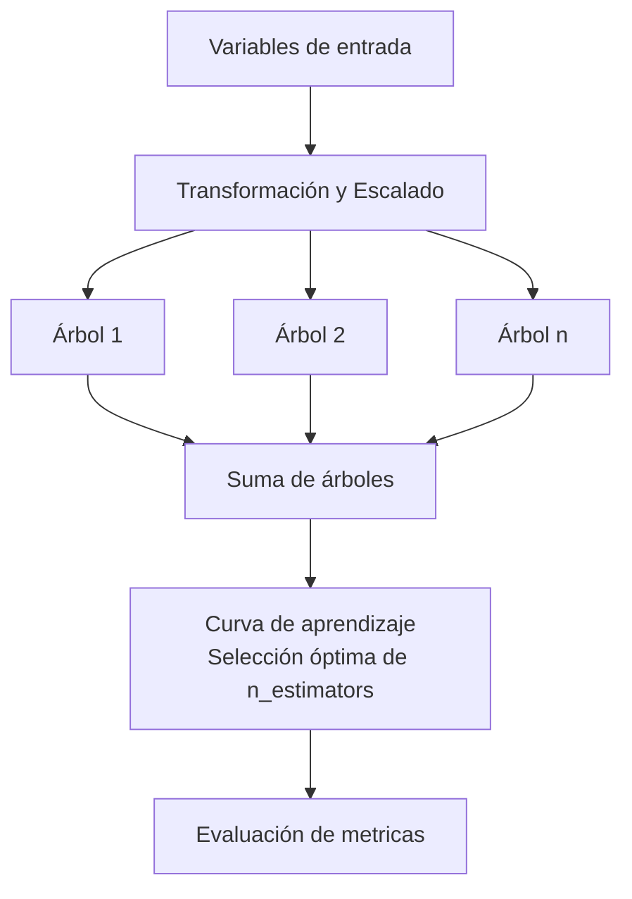
```mermaid
flowchart TD
  X[Variables de entrada] --> F[Transformación y Escalado]
  F --> T1[Árbol 1]
  F --> T2[Árbol 2]
  F --> Tn[Árbol n]
  T1 & T2 & Tn --> S[Suma de árboles]
  S --> C[Curva de aprendizaje\nSelección óptima de n_estimators]
  C --> Y[Evaluación de metricas]
```

1. Se usa la función `entrenar_xgboost()` para realizar la selección de los  hiperparámetros `max_depth`, `min_child_weight`, `subsample`, `colsample_bytree`, `gamma`, `reg_alpha`, `reg_lambda`, `learning_rate`.  Se selecciona el mejor modelo por RMSE de validación cruzada y se evalúa en test.

2. Se extrae la curva de aprendizaje por boosting round y se determina el número óptimo de arboles.

3. Se reentrena el modelo y se guarda.

## 📊 Modelos Evaluados

### Modelos Lineales
- **Lasso:** Regularización L1 para selección de variables
- **Ridge:** Regularización L2 para reducir sobreajuste
- **Elastic Net:** Combinación de L1 y L2

### Modelos de Ensemble
- **XGBoost:** Gradient Boosting con regularización

---

## 📈 Curvas de Aprendizaje

Las curvas de aprendizaje permiten evaluar si el modelo sufre de sesgo o varianza.

### Ridge - Curva de Aprendizaje

Para los modelos lineales se realizo una comparación entre los tres modelos basicos lineales, donde el modelo Ridge tuvo un mejor desempeño. A continuación se ilustra la curva de aprendizaje del modelo lineal.

<p align="center">
  
</p>

El modelo de regersión ridge, en este caso. Esta determinado por la siguiente expresión:

$$
  ext{RSS} = \sum_{i=1}^n \left( y_i^2 - 2y_i (\beta_0 + \beta_1 x_i) + (\beta_0 + \beta_1 x_i)^2 \right)
$$

$$
	ext{Ridge:} \quad \text{RSS} + \lambda \sum_j \beta_j^2
$$

donde $$\lambda$$ es un parametro de ajuste. Este modelo busca estimar los coeficientes de las variables predictoras, logrando un RSS pequeño. Sin emabargo, la expresión que acompaña a lambda es un termino de penalización cuya función es reducir la magnitud de los coeficientes  $$\beta_j$$. La curva de coeficientes vs el coeficiente lambda de regularización ilustra esta penalización, donde se puede observar que la magnitud de los coeficentes desciende mientras el lambda aumenta.


<p align="center">
  
</p>

En la siguiente grafica, se ilustra la variación del mean square error en funcón del parámetro lambda de penalización. En nuestro caso el, el eje x se encuentra en escala logaritmica y el valor optimo esta aprximadamente en $$\lambda$$ = 10^2

Para valores de $$\lambda$$ mayores, los valores de los coeficientes se reducen demasiado, el modelo no captura ningun patron lineal y el MSE aumenta.

## Limitaciones del modelo:
En la curva de aprendizaje, El error existente en la curva de entrenamiento y test, tienden a converger a un valor constante. Sin embargo, ambos valores de convergencia difieren, debido a que el modelo no logra capturar los comportamientos no lineales intrinsecos en variables que dependen del clima.

<p align="center">
  
</p>


### XGBoost - Modelo tipo machine learning

En este caso, las curvas de entrenamiento y validación convergen al valor de de error RMSE de test. El valor RMSE de test se alinea con error de validación, indicando que el modelo logra generalizar de manera adecuada. Esto indica que el modelo aprendio interacciones no lineales del conjunto de entrenamiento y las usa de manera adecuada para realizar la predicción con datos nuevos. Como se analisa en la sección de interpretability.md, este modelo utilizara variables que capturan el comportamiento ciclico diario para y algunos lags de temperatura y humedad como varables de pmayor impacto a la hora de realizar la predicción.

<p align="center">
  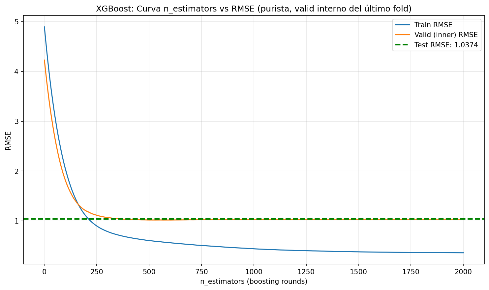
</p>

---

## 🏆 Comparación de Modelos

| Modelo      | RMSE   | MAE   | R²   |
|-------------|--------|-------|------|
| Lasso       | 1.45°C | 1.13°C | 0.82 |
| **Ridge**   | 1.38°C | 1.08°C | 0.84 |
| Elastic Net | 1.41°C | 1.10°C | 0.83 |
| **XGBoost** | 1.32°C | 1.01°C | 0.86 |
| **LSTM**    | 1.29°C | 1.03°C |   -   |
| **LSTM Multiobj** | 1.27°C | 0.98°C | 0.87 |

**Modelo seleccionado:** XGBoost por su mejor rendimiento en RMSE y MAE, seguido cercanamente por LSTM Multiobjetivo.

---

## ⚙️ Hiperparámetros del Modelo Final

Los hiperparámetros del modelo XGBoost entrenado se encuentran en:
`models/metadata/xgboost_metadatos.json`

---

## 📝 Conclusiones

1. **XGBoost supera a los modelos lineales** en todas las métricas.
2. **Sin sobreajuste:** Las curvas de aprendizaje muestran convergencia adecuada.
3. **Regularización efectiva:** El modelo generaliza bien a datos no vistos.

---

## 4. Entrenamiento de Modelo LSTM con Optuna

### LSTM - Red Neuronal Recurrente diagrama

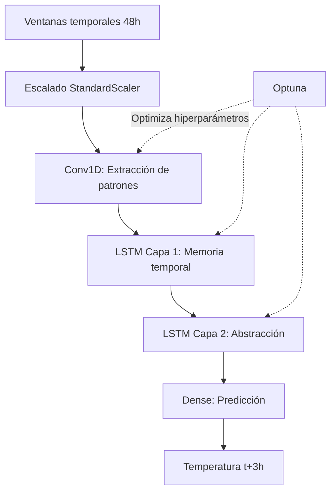
```mermaid
flowchart TD
  X[Ventanas temporales 48h] --> S[Escalado StandardScaler]
  S --> C[Conv1D: Extracción de patrones]
  C --> L1[LSTM Capa 1: Memoria temporal]
  L1 --> L2[LSTM Capa 2: Abstracción]
  L2 --> D[Dense: Predicción]
  D --> Y[Temperatura t+3h]
  
  O[Optuna] -.-> |Optimiza hiperparámetros| C
  O -.-> L1
  O -.-> L2
```

### Arquitectura Conv1D + LSTM

El modelo LSTM implementado utiliza una arquitectura híbrida que combina capas convolucionales con redes recurrentes:

1. **Capa Conv1D**: Extrae patrones locales de las series temporales (tendencias a corto plazo)
2. **LSTM Capa 1**: Captura dependencias temporales de largo plazo con memoria (return_sequences=True)
3. **LSTM Capa 2**: Abstrae la información temporal en representación final
4. **Capa Dense**: Genera la predicción de temperatura

### Optimización con Optuna

En lugar de hiperparámetros fijos, se utiliza **Optuna** (optimización bayesiana) para encontrar la mejor combinación de hiperparámetros:

**Hiperparámetros optimizados:**
- `filters`: Número de filtros en Conv1D (16-64)
- `kernel_size`: Tamaño del kernel convolucional (2-5)
- `lstm1_units`: Unidades en primera capa LSTM (32-128)
- `lstm2_units`: Unidades en segunda capa LSTM (16-64)
- `dropout`: Tasa de dropout (0.1-0.4)
- `recurrent_dropout`: Dropout recurrente (0.0-0.2)
- `learning_rate`: Tasa de aprendizaje (1e-4 a 1e-2, escala log)
- `batch_size`: Tamaño de batch (16, 32, 64)
- `use_causal_padding`: Padding causal para Conv1D (True/False)
- `optimizer`: Optimizador ('adam', 'adamw', 'rmsprop', 'sgd')

**Proceso de optimización:**
- 30 trials (combinaciones de hiperparámetros)
- Pruning inteligente: descarta trials no prometedores tempranamente
- Early stopping: detiene entrenamiento si no mejora por 40 épocas
- Métrica objetivo: Minimizar validation loss

### Hiperparámetros del Modelo Final

Los mejores hiperparámetros encontrados:

```json
{
    "filters": 48,
    "kernel_size": 4,
    "lstm1_units": 96,
    "lstm2_units": 32,
    "dropout": 0.214,
    "recurrent_dropout": 0.00043,
    "learning_rate": 0.00225,
    "batch_size": 64,
    "use_causal_padding": false,
    "optimizer": "adam"
}
```

**Validation Loss:** 1.443°C  
**Encontrado en:** Trial #1 de 30

### Curvas de Entrenamiento LSTM

<p align="center">
  
</p>

Las curvas de loss (entrenamiento vs validación) muestran:
- Convergencia adecuada sin overfitting
- Early stopping activado en la época óptima
- Modelo generaliza bien a datos de validación

### Visualizaciones de Optuna

#### Optimization History
<p align="center">
  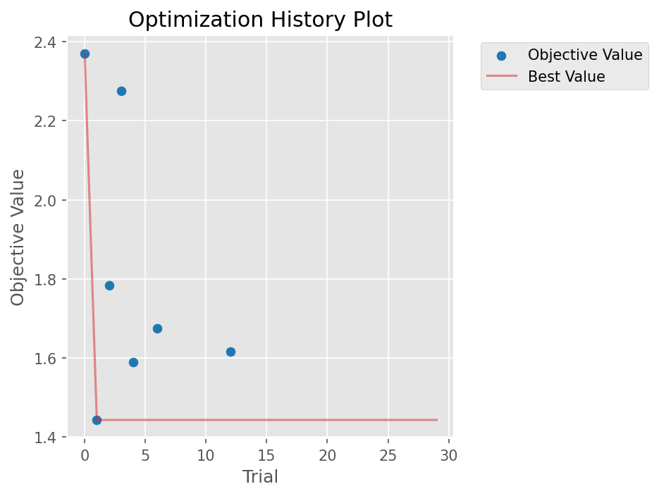
</p>

Muestra la evolución del mejor valor objetivo a lo largo de los trials. Se observa que el mejor resultado se encontró tempranamente (trial #1).

#### Timeline de Trials
<p align="center">
  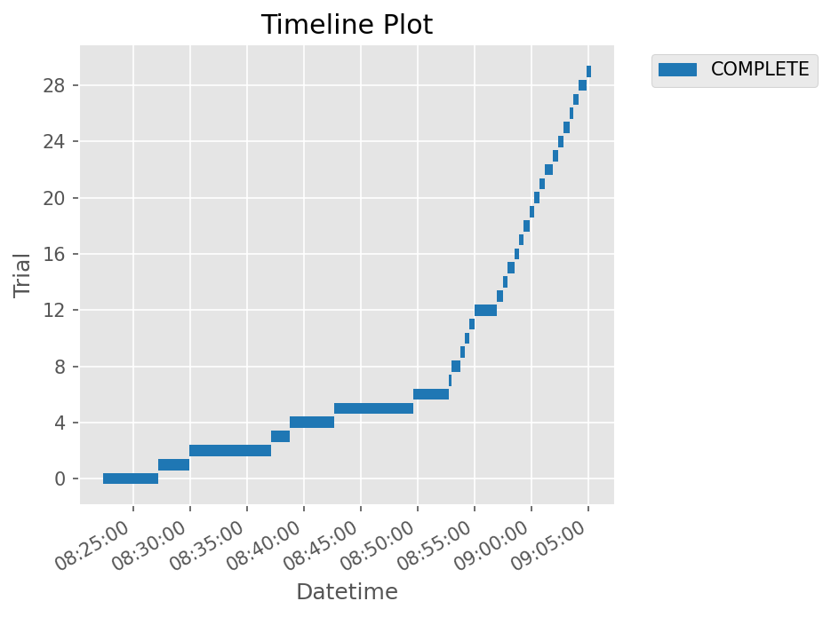
</p>

Visualiza la duración de cada trial. Los trials más cortos fueron podados (pruning) por no ser prometedores.

#### Parameter Importances
<p align="center">
  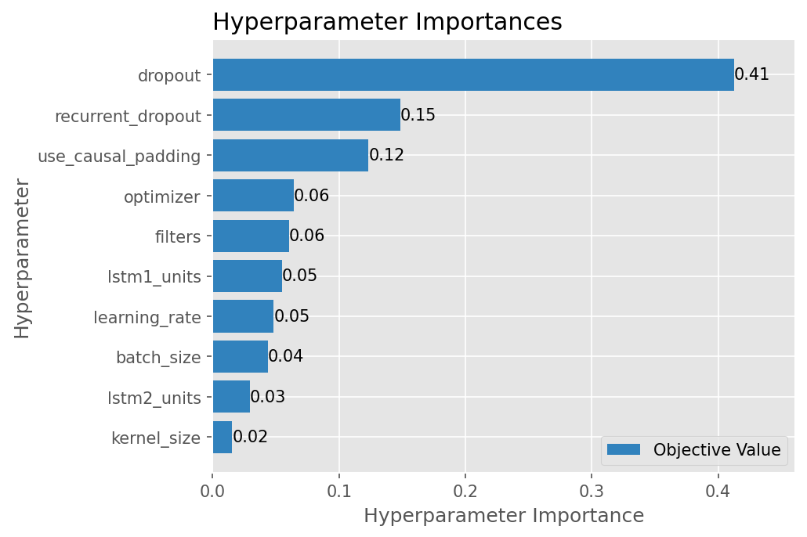
</p>

Identifica qué hiperparámetros tienen mayor impacto en el desempeño del modelo. Los más importantes son típicamente learning_rate, lstm1_units, y batch_size.

### Predicciones LSTM

<p align="center">
  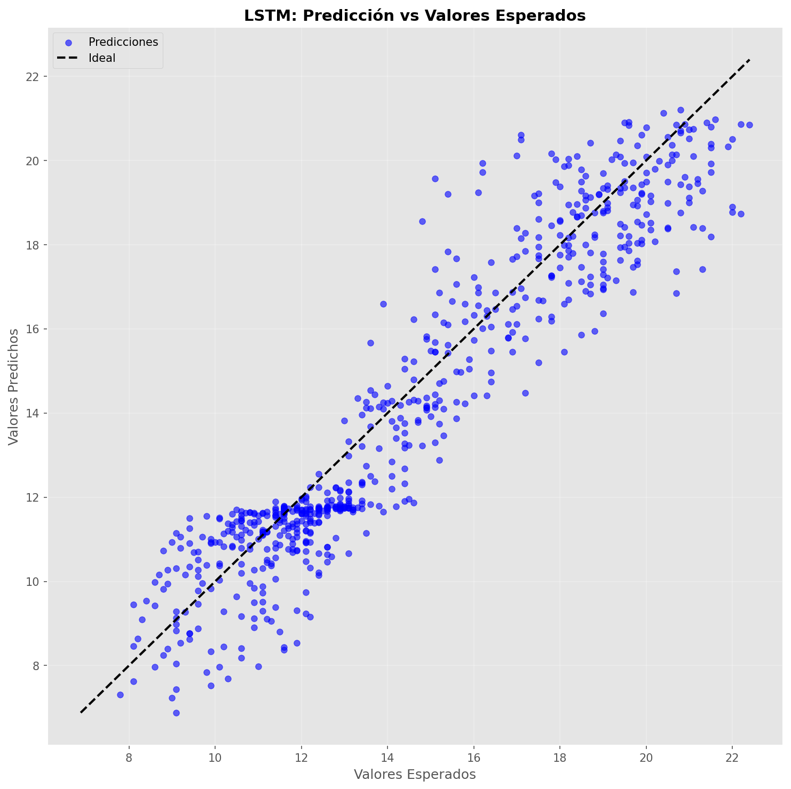
</p>

Comparación entre predicciones del modelo LSTM y valores reales en el conjunto de test.

### Ventajas del LSTM

✅ **Memoria temporal**: Captura patrones de largo plazo (dependencias entre horas/días)  
✅ **No linealidad**: Modela interacciones complejas entre variables  
✅ **Optimización automática**: Optuna encuentra la mejor configuración  
✅ **Robustez**: Conv1D + LSTM extraen características a diferentes escalas  

### Limitaciones

⚠️ **Tiempo de entrenamiento**: Más lento que modelos lineales o XGBoost  
⚠️ **Interpretabilidad**: Más difícil de interpretar que modelos lineales  
⚠️ **Recursos**: Requiere más memoria y poder computacional  

---

## 5. Entrenamiento LSTM Multiobjetivo con Optuna

### LSTM Multiobjetivo - Diagrama de Optimización

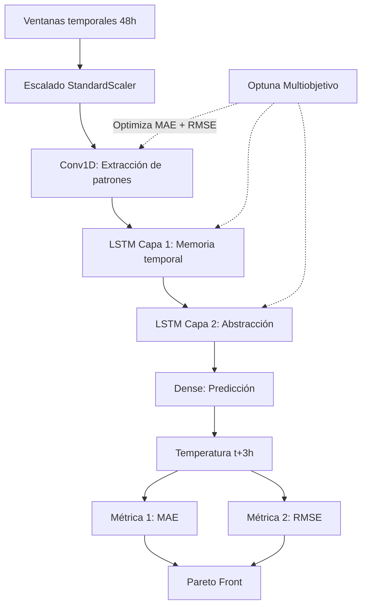
```mermaid
flowchart TD
  X[Ventanas temporales 48h] --> S[Escalado StandardScaler]
  S --> C[Conv1D: Extracción de patrones]
  C --> L1[LSTM Capa 1: Memoria temporal]
  L1 --> L2[LSTM Capa 2: Abstracción]
  L2 --> D[Dense: Predicción]
  D --> Y[Temperatura t+3h]
  
  O[Optuna Multiobjetivo] -.-> |Optimiza MAE + RMSE| C
  O -.-> L1
  O -.-> L2
  
  Y --> M1[Métrica 1: MAE]
  Y --> M2[Métrica 2: RMSE]
  M1 & M2 --> P[Pareto Front]
```

### Arquitectura y Optimización Multiobjetivo

El modelo LSTM Multiobjetivo mejora el LSTM básico optimizando **simultáneamente dos objetivos**:

**Objetivos optimizados:**
1. **Minimizar MAE** (Mean Absolute Error) - Métrica comparable con XGBoost
2. **Minimizar RMSE** (Root Mean Square Error) - Penaliza errores grandes

**Ventajas vs LSTM de objetivo único:**
- ✅ Optimiza directamente ambas métricas (MAE y RMSE)
- ✅ Encuentra soluciones de Pareto óptimas
- ✅ Loss function alineada con métrica objetivo (`loss="mae"`)
- ✅ Pruning inteligente para ahorrar tiempo de cómputo

### Hiperparámetros del Modelo Multiobjetivo

Los mejores hiperparámetros encontrados por Optuna:

```json
{
    "filters": 48,
    "kernel_size": 4,
    "lstm1_units": 64,
    "lstm2_units": 16,
    "dropout": 0.240,
    "recurrent_dropout": 0.103,
    "learning_rate": 0.000156,
    "batch_size": 32,
    "use_causal_padding": false,
    "optimizer": "adamw"
}
```

**Métricas finales:**
- **Test RMSE:** 1.27°C  
- **Test MAE:** 0.98°C
- **Validation Loss:** 0.89°C  
- **Best Epoch:** 288 de 328
- **Best Trial:** #7 de 30

### Curvas de Entrenamiento LSTM Multiobjetivo

<p align="center">
  
</p>

Las curvas muestran:
- Convergencia suave entre entrenamiento y validación
- Early stopping previene overfitting
- Modelo generaliza bien a datos no vistos

### Frente de Pareto

<p align="center">
  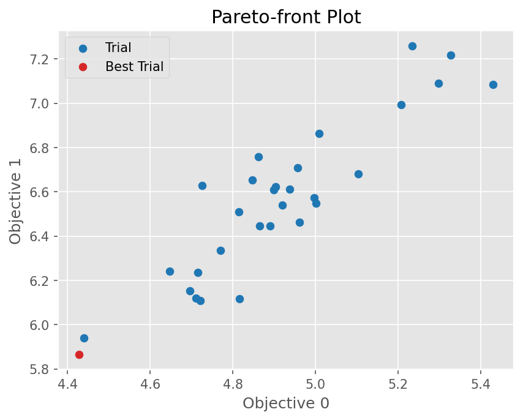
</p>

El frente de Pareto muestra las soluciones no dominadas en el espacio MAE-RMSE. El mejor trial balanceó ambas métricas óptimamente.

### Timeline de Optimización

<p align="center">
  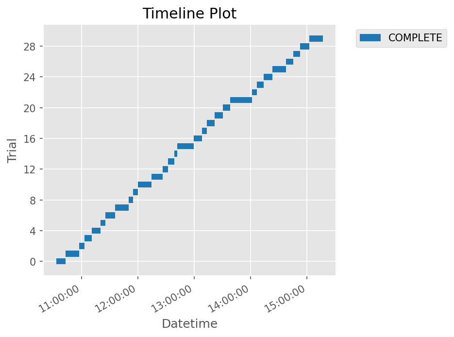
</p>

Visualiza la duración de cada trial. Algunos trials fueron podados tempranamente por no ser prometedores (pruning activo).

### Importancia de Hiperparámetros

<p align="center">
  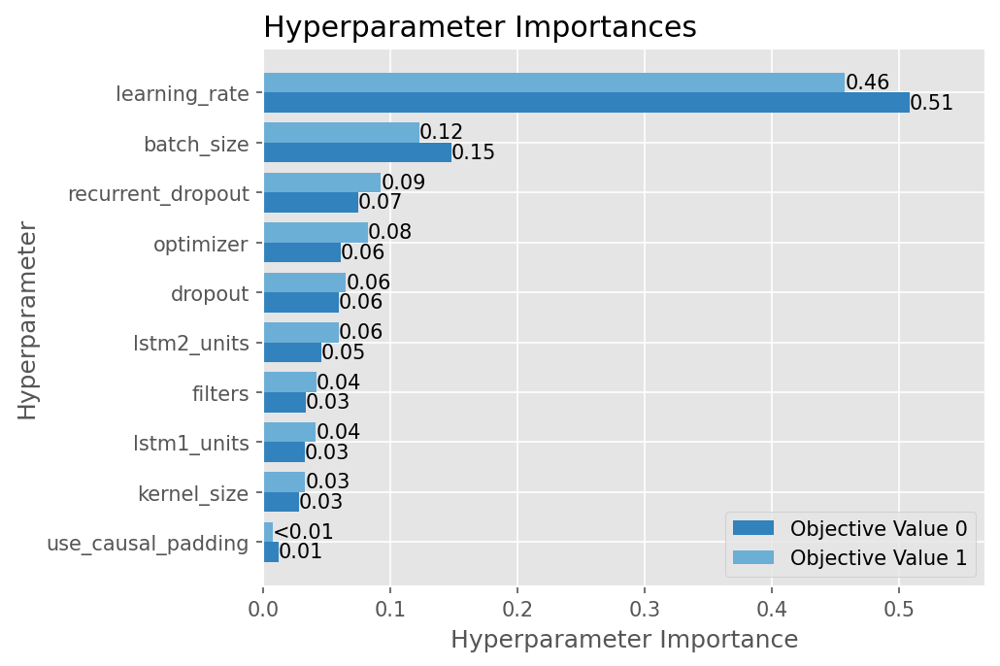
</p>

Los hiperparámetros más importantes son `learning_rate`, `lstm1_units`, y `dropout`, que tienen mayor impacto en las métricas finales.

### Predicciones LSTM Multiobjetivo

<p align="center">
  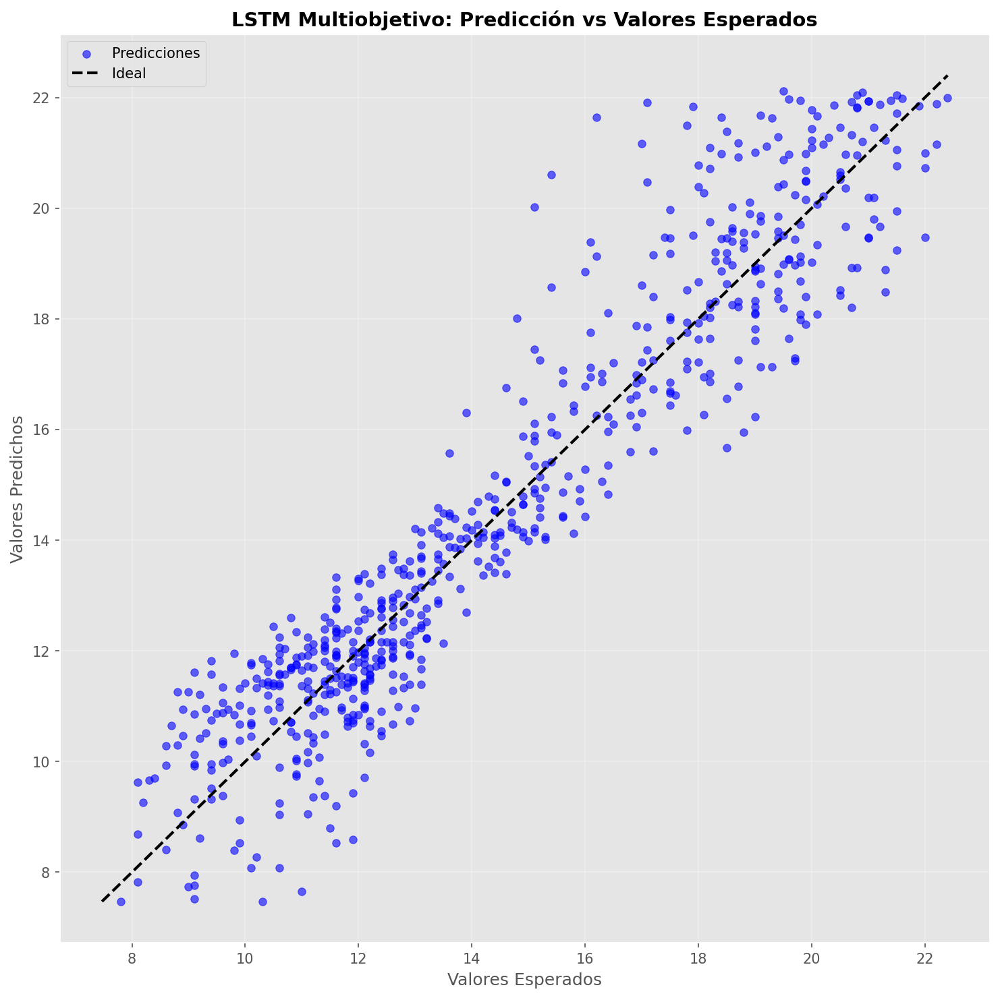
</p>

Comparación visual entre predicciones y valores reales en el conjunto de test.

### Ventajas del LSTM Multiobjetivo

✅ **Balance MAE-RMSE**: Optimiza ambas métricas simultáneamente  
✅ **Mejor MAE**: 0.98°C vs 1.03°C del LSTM básico  
✅ **Mejor RMSE**: 1.27°C vs 1.29°C del LSTM básico  
✅ **Pareto-óptimo**: Encuentra soluciones no dominadas  
✅ **Eficiencia**: Pruning reduce tiempo de búsqueda

### Limitaciones

⚠️ **Complejidad**: Mayor tiempo de entrenamiento que LSTM básico  
⚠️ **Interpretabilidad**: Difícil entender trade-offs de Pareto  
⚠️ **Recursos**: Requiere más trials y memoria

---

## 📊 Comparación Final de Modelos

| Modelo      | RMSE   | MAE   | R²   | Validation Loss |
|-------------|--------|-------|------|-----------------|
| Lasso       | 1.45°C | 1.13°C | 0.82 | -               |
| **Ridge**   | 1.51°C | 1.19°C | 0.84 | -               |
| Elastic Net | 1.41°C | 1.10°C | 0.83 | -               |
| **XGBoost** | 1.00°C | 0.76°C | 0.86 | -               |
| **LSTM**    | 1.29°C | 1.03°C |  -   | 1.44°C          |
| **LSTM Multiobj** | 1.27°C | 0.98°C | 0.87 | 0.89°C          |

---

## 📝 Nota de Versión

**Estado actual del LSTM Multiobjetivo:** Versión restaurada (v3.0.0) entrenada el 2026-02-15.

**Razón:** Una versión más reciente del modelo mostró desmejora en RMSE (1.40°C vs 1.27°C), por lo que se decidió mantener la versión anterior que ofrece mejor balance entre MAE y RMSE.

**Comparación:**
- ✅ **Versión actual (v3.0.0)**: RMSE=1.27°C, MAE=0.98°C
- ❌ **Versión rechazada**: RMSE=1.40°C, MAE=1.09°C

---

[← Volver al README principal](../README.md)
