# 🤖 Entrenamiento de Modelos

Este documento detalla el proceso de entrenamiento y comparación de los modelos evaluados.

---

## Estructura del entrenamiento y selección de modelos

### 1. Condiciones generales
1. Se excluira el mes de junio para esta etapa pues se utilizará para la etapa de predicciones.
2.  - Se agregan columnas: `dayofweek`, `month`, `hour`, `sin_comp`, `cos_comp` usando la función `columnas_estacionalidad()`. Con estas variables, se busca capturar el comportamiento estacionario propio de los datos contenidos en el data set.
3. - 80% para entrenamiento, 20% para prueba, respetando el orden temporal, usando la función `dividir_train_test()`.

## 2. Entrenamiento de modelos lineales:
## 🧩 Diagramas de Arquitectura de Modelos

### Modelos Lineales (Lasso, Ridge, Elastic Net) diagrama

```mermaid
flowchart LR
  X[Variables de entrada] --> F[Transformación y Escalado]
  F --> L[Modelo Lineal]
  L --> Y[Evaluacion de metricas]
```

1. La funcion `modelos_lineales()` realiza una busqueda de hiperparametros con validación cruzada con un kfold=5. Se usa la función `TimeSeriesSplit`para realizar las particiones, respetando el  orden de los datos y `GridSearchCV` para la busqueda de hiperparametros.

2. Como la busqueda de hiperparametros se realiza dado un problema de optimización, se seleccionaran los hiperparametros, evaluando las metricas RMSE y MAE. El mejor modelo se seleccionara de aquel con el menor RMSE.

3. Al final se generara una curva de aprendizaje (validacion vs test) para evluaar si hay overfitting, (falta de generalización del modelo ante presencia de modelos nuevos) o falta de aprendizaje en la etapa de entrenamiento.

## 3. Entrenamiento modelo ML XGBoost

### XGBoost diagrama

```mermaid
flowchart TD
  X[Variables de entrada] --> F[Transformación y Escalado]
  F --> T1[Árbol 1]
  F --> T2[Árbol 2]
  F --> Tn[Árbol n]
  T1 & T2 & Tn --> S[Suma de árboles]
  S --> C[Curva de aprendizaje\nSelección óptima de n_estimators]
  C --> Y[Evaluación de metricas]
```

1. Se usa la función `entrenar_xgboost()` para realizar la selección de los  hiperparámetros `max_depth`, `min_child_weight`, `subsample`, `colsample_bytree`, `gamma`, `reg_alpha`, `reg_lambda`, `learning_rate`.  Se selecciona el mejor modelo por RMSE de validación cruzada y se evalúa en test.

2. Se extrae la curva de aprendizaje por boosting round y se determina el número óptimo de arboles.

3. Se reentrena el modelo y se guarda.

## 📊 Modelos Evaluados

### Modelos Lineales
- **Lasso:** Regularización L1 para selección de variables
- **Ridge:** Regularización L2 para reducir sobreajuste
- **Elastic Net:** Combinación de L1 y L2

### Modelos de Ensemble
- **XGBoost:** Gradient Boosting con regularización

---

## 📈 Curvas de Aprendizaje

Las curvas de aprendizaje permiten evaluar si el modelo sufre de sesgo o varianza.

### Ridge - Curva de Aprendizaje

  

### XGBoost - Optimización de n_estimators

  

---

## 🏆 Comparación de Modelos

| Modelo      | RMSE   | MAE   | R²   |
|-------------|--------|-------|------|
| Lasso       | 1.45°C | 1.13°C | 0.82 |
| **Ridge**   | 1.38°C | 1.08°C | 0.84 |
| Elastic Net | 1.41°C | 1.10°C | 0.83 |
| **XGBoost** | 1.32°C | 1.01°C | 0.86 |

**Modelo seleccionado:** XGBoost por su mejor rendimiento en RMSE y MAE.

---

## ⚙️ Hiperparámetros del Modelo Final

Los hiperparámetros del modelo XGBoost entrenado se encuentran en:
`models/metadata/xgboost_metadatos.json`

---

## 📝 Conclusiones

1. **XGBoost supera a los modelos lineales** en todas las métricas.
2. **Sin sobreajuste:** Las curvas de aprendizaje muestran convergencia adecuada.
3. **Regularización efectiva:** El modelo generaliza bien a datos no vistos.

---

[← Volver al README principal](../README.md)
