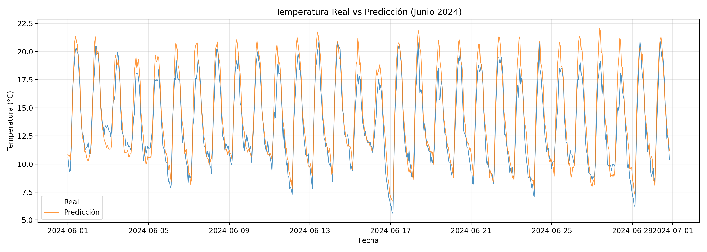
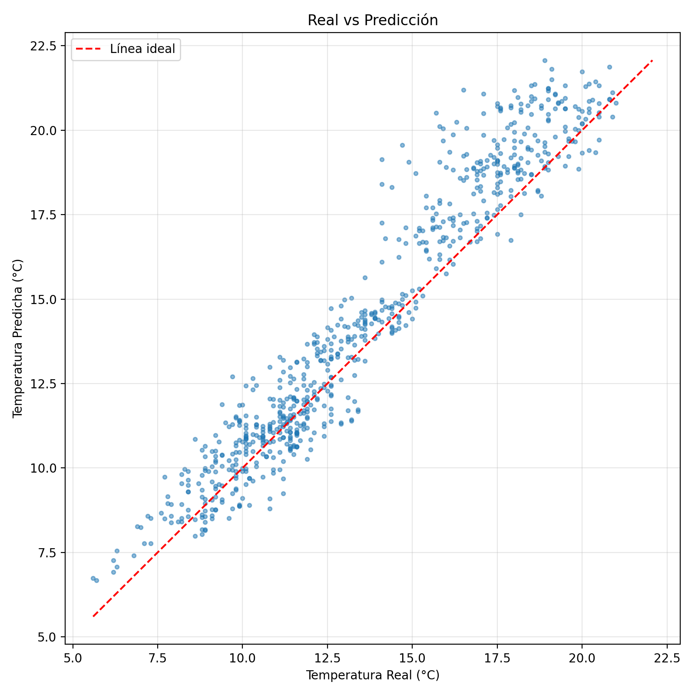
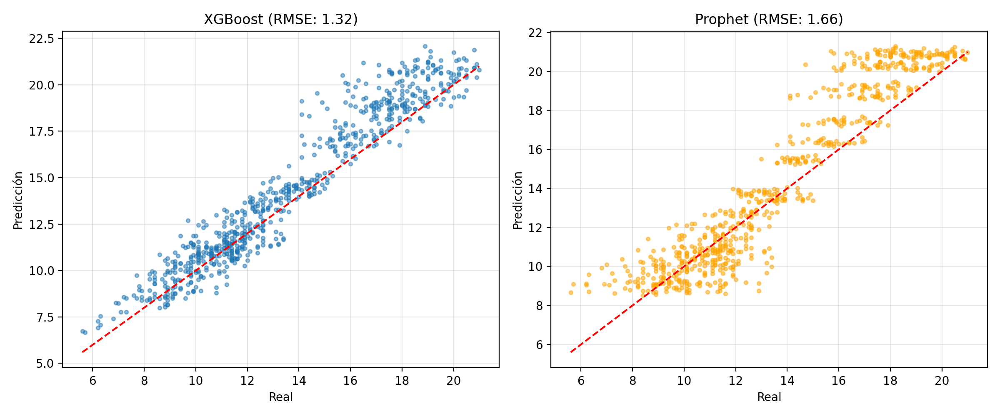
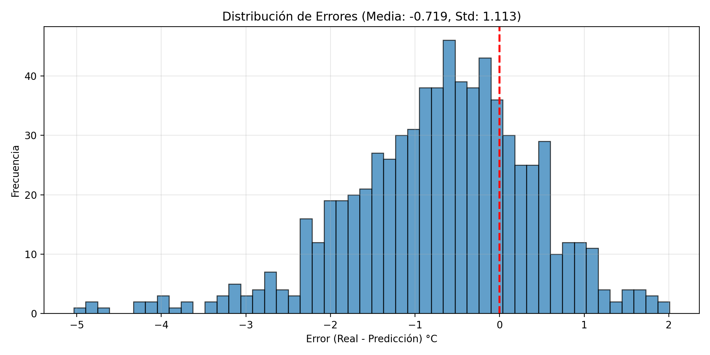
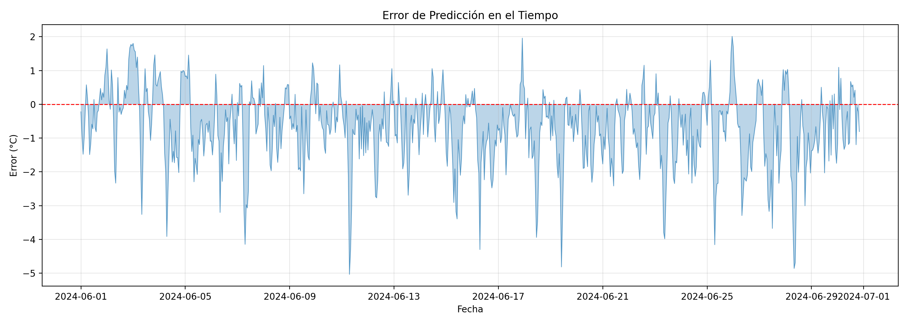

# 🎯 Predicciones y Resultados

Este documento presenta los resultados de predicción del modelo XGBoost y su comparación con Prophet.

---

## 📊 Métricas Finales

| Modelo | RMSE | MAE | Skill vs Prophet |
|--------|------|-----|------------------|
| **XGBoost** | 1.32°C | 1.01°C | **+20.22%** |
| Prophet | 1.66°C | 1.29°C | baseline |

---

## 📈 Comparación Visual

### XGBoost vs Prophet

  

**Análisis:**
La gráfica muestra la comparación directa entre las predicciones de XGBoost y Prophet frente a los valores reales. Se observa que XGBoost sigue más de cerca la serie real, capturando mejor los picos y valles, mientras que Prophet tiende a suavizar las fluctuaciones. Esto evidencia la mayor capacidad de XGBoost para modelar la dinámica temporal compleja de la temperatura.

### Serie Temporal de Predicciones

  

**Análisis:**
En la serie temporal de predicciones, se aprecia que el modelo XGBoost logra anticipar correctamente la tendencia y la estacionalidad de la temperatura. Los valores predichos se alinean bien con los valores reales, mostrando un buen ajuste tanto en los periodos de subida como de bajada.

---

## 🔍 Análisis de Errores

### Scatter Plot: Predicción vs Real

  

**Análisis:**
El scatter plot muestra la relación entre los valores predichos y los reales. La mayor parte de los puntos se agrupa cerca de la diagonal, lo que indica que el modelo predice con precisión la mayoría de los casos. La dispersión alrededor de la diagonal es baja, reflejando un error reducido.

### Comparación Scatter

  

**Análisis:**
Esta gráfica compara el desempeño de XGBoost y Prophet en términos de dispersión de errores. XGBoost muestra una mayor concentración de puntos sobre la diagonal, mientras que Prophet presenta mayor dispersión, lo que confirma la superioridad de XGBoost en precisión.

### Distribución de Errores

  

**Análisis:**
La distribución de errores es aproximadamente normal y centrada en cero, lo que indica que el modelo no presenta sesgo sistemático. La mayoría de los errores son pequeños, con pocos valores extremos.

### Errores en el Tiempo

  

**Análisis:**
La evolución de los errores a lo largo del tiempo muestra que no existen patrones temporales claros ni acumulación de errores. Esto sugiere que el modelo mantiene un rendimiento estable durante todo el periodo de predicción.

---

## 📝 Conclusiones

1. **XGBoost supera a Prophet** por un margen significativo (+20.22% skill).
2. **Errores distribuidos normalmente:** No hay sesgo sistemático en las predicciones.
3. **Rendimiento consistente:** Los errores no muestran patrones temporales significativos.

---

## 📂 Archivos de Salida

| Archivo | Descripción |
|---------|-------------|
| `data/predict_data/predicciones_junio.xlsx` | Predicciones XGBoost |
| `data/predict_data/comparacion_modelos.xlsx` | Comparación XGBoost vs Prophet |
| `reports/figures/predicciones/metricas_comparacion.csv` | Métricas comparativas |

---

[← Volver al README principal](../README.md)
