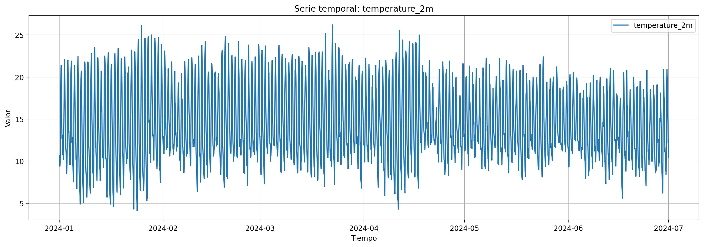
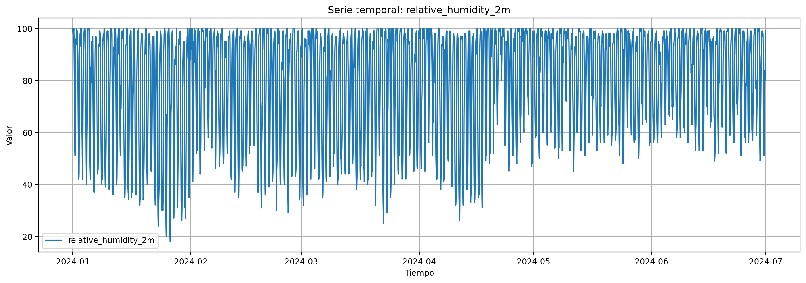
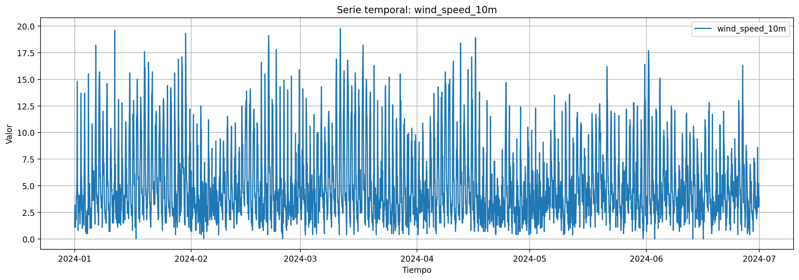

# 📈 Análisis Temporal

Este documento presenta el análisis de series temporales realizado para identificar patrones y determinar los lags óptimos para el modelo predictivo.

---

## 📉 Series Temporales

### Temperatura

  

**Observaciones:**
- Se observa un patrón cíclico diario claro con máximos alrededor del mediodía (hasta 26.2°C) y mínimos en la madrugada (hasta 4.1°C).
- La temperatura media es de **14.46°C** con una desviación estándar de 4.49°C.
- La amplitud térmica diaria oscila aproximadamente entre 9°C y 22°C, típico del clima de Bogotá.
- No se evidencian tendencias marcadas a largo plazo en el periodo Enero-Junio 2024.
- La estacionalidad diaria (24 horas) es el componente dominante de la serie.

### Humedad Relativa

  

**Observaciones:**
- Comportamiento inversamente correlacionado con la temperatura: máximos en la noche/madrugada y mínimos al mediodía.
- La humedad media es de **79.86%** con alta variabilidad (σ = 20.86%).
- Rango de valores entre 18% (días secos al mediodía) y 100% (saturación frecuente).
- El 50% de los datos supera el 90% de humedad (mediana), indicando condiciones predominantemente húmedas.
- Saturación frecuente (100%) en horas nocturnas, característico del clima tropical de montaña de Bogotá.

### Velocidad del Viento

  

**Observaciones:**
- Mayor variabilidad y comportamiento menos predecible que temperatura y humedad.
- Velocidad media de **5.10 km/h** con desviación estándar de 3.62 km/h.
- Rango entre calma total (0 km/h) y ráfagas de hasta 19.8 km/h.
- Patrón diario presente: vientos más intensos en horas de la tarde (16:00-18:00), coincidiendo con el enfriamiento.
- La distribución está sesgada a la derecha (mediana 3.9 km/h < media 5.1 km/h), indicando eventos ocasionales de vientos fuertes.

---

## 🔄 Autocorrelación (ACF & PACF)

El análisis de autocorrelación permite identificar la relación de la temperatura con sus valores pasados.

### Temperatura - ACF y PACF

  

**Interpretación:**
- **ACF (Autocorrelation Function):** Mide la correlación lineal entre la serie temporal en un instante de tiempo y ella misma desplazada k periodos.
- **PACF (Partial Autocorrelation Function):** Mide la correlación directa entre diferentes instantes, controlando por los valores intermedios.

---

## 🔗 Correlación Cruzada

La correlación cruzada identifica qué valores pasados de las variables independientes ayudan a explicar los valores futuros de la temperatura.

### Temperatura vs Humedad Relativa

  

### Temperatura vs Velocidad del Viento

  

---

## 📝 Conclusiones del Análisis Temporal

1. **Estacionalidad clara:** Se observa un patrón diario (24 horas) en la temperatura.
2. **Lags significativos:** Los lags 1, 2, 3, 6, 12 y 24 horas muestran correlación significativa.
3. **Correlación cruzada:** La humedad relativa tiene correlación negativa con la temperatura en lags de 6-12 horas.

Para más detalles sobre la selección de lags, ver [Selección de Lags](lag_selection.md).

---

[← Volver al README principal](../README.md)
